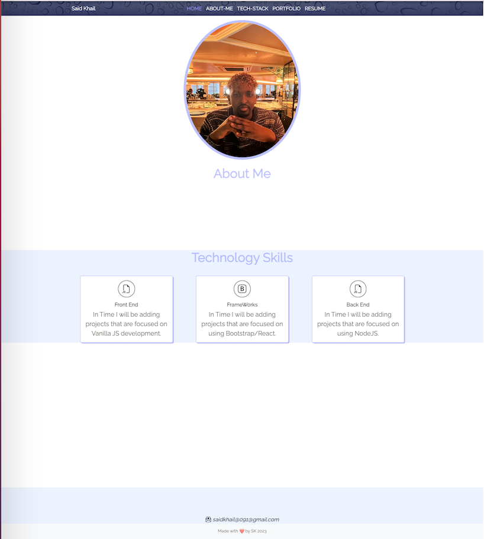

# Bootstrap-Portfolio

## Description

The objective here is to leverage the capabilities of Bootstrap 5 alongside tailored CSS modifications, all within the framework of imposed constraints centered around the utilization of Media Queries. By incorporating Bootstrap 5, we aim to harness its robust set of pre-designed components and responsive grid system, complementing them with custom CSS adjustments to achieve a tailored aesthetic and functionality. Within this context, Media Queries serve as a pivotal tool for ensuring that our design remains adaptable across various devices and screen sizes, ultimately enhancing the overall user experience.

## Installation

1.  Clone the repository to your local machine using:
    git clone https://github.com/SKhail/Bootstrap-Portfolio.git
    cd Bootstrap-Portfolio
2.  Once cloned, you can start the application
3.  You will have it in your local machines and can start the Application.

## Usage

1.  Clone the repository to your local machine using:
    git clone https://github.com/SKhail/Bootstrap-Portfolio.git
    cd Bootstrap-Portfolio
2.  Once cloned, you can start the application
3.  You will have it in your local machines and can start the Application.
4.  A screenshot location will be provided below to show how the website looks:

     

### External Resources

- [https://michalsnik.github.io/aos/] - This was used for the animated scrolls. It first needed to Initialise the AOS and you are able to add the snippets of the div tags in the Html file.

- [https://www.flatuicolorpicker.com/blue-rgba-color-model/]
  Colour Palette.

- [https://www.pexels.com/search/website%20background/]
  It was used as a background cover for the navigation.

- [https://getbootstrap.com/docs/5.0/components/scrollspy/#via-data-attributes]  
  Scrolling Effect.

- [https://icons.getbootstrap.com/icons/]Implemented Icons

## Credits

N/A

## License

This project is licened under the MIT License.

## Badges

N/A

## Features

N/A

## Testing

N/A

## Resource
